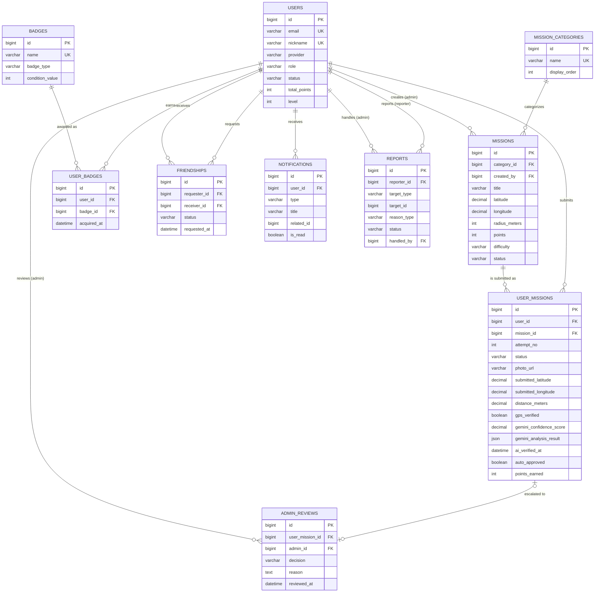

# K-Life-Guide MySQL ERD

## 설계 메모

### user_missions — 미션 인증 (GPS + 사진 + Gemini confidence)
- 한 유저가 같은 미션을 여러 번 재시도(반려 후 재제출)할 수 있다고 가정해 `(user_id, mission_id, attempt_no)` 조합을 유니크 키로 둠.
- `submitted_latitude` / `submitted_longitude`는 사진 촬영 시점에 클라이언트가 보낸 GPS, `distance_meters`는 서버에서 `missions.latitude/longitude` 대비 계산해 저장(Haversine).
- `gps_verified`는 `distance_meters <= missions.radius_meters` 여부를 저장한 캐시 플래그.
- `gemini_confidence_score`는 0.00~100.00 스케일, `gemini_analysis_result`는 Gemini 응답 원문(JSON: 라벨, 근거, 점수 breakdown 등)을 그대로 저장.
- `status` 흐름: `PENDING_REVIEW` → (GPS+AI 자동 판정) → `AI_APPROVED` / `NEEDS_ADMIN_REVIEW`(낮은 confidence 또는 GPS 불일치) / `AI_REJECTED` → 관리자 개입 시 `APPROVED` / `REJECTED`로 확정.
- `auto_approved`는 confidence가 임계값 이상이고 GPS도 통과해 관리자 검수 없이 자동 승인된 경우 true.

### admin_reviews
- `user_mission_id`에 UNIQUE 제약을 둬 1건의 인증 시도당 관리자 검수는 1회 결과만 남도록 함(재검수가 필요하면 재제출/새 attempt로 처리).

### friendships
- 단방향 요청(`requester_id` → `receiver_id`) 1행으로 관계를 표현, `status`로 PENDING/ACCEPTED/REJECTED/BLOCKED 관리.
- `(requester_id, receiver_id)` 유니크 + `requester_id <> receiver_id` 체크로 중복 요청과 자기 자신에게 요청하는 것을 방지.
- A→B, B→A가 동시에 존재할 수 있으므로(서로 요청) 애플리케이션 레벨에서 기존 요청 존재 여부를 먼저 확인하는 로직이 필요.

### reports / notifications
- `target_type` + `target_id`로 다형성 참조(예: `USER`, `USER_MISSION`)를 표현. FK 제약은 걸지 않고 애플리케이션에서 유효성 검증.
- `notifications.related_id`도 동일한 다형성 참조용(타입은 `type` 컬럼으로 구분).
